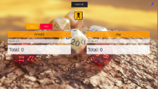

# Pig Dice


### Author: Arnold Oduma

This is a simple web application that emulates a pig dice game

## BDD
 Behavior: <br>*The program should:*       | Input:    | Output:     |
|:-------------|:------------- |:-------------|
| Player 1 inputs their name and Player 2 inputs the name and clicks Play Now button |Player 1: Arnold   Player2: Oduma  Click Play Now  | Goes to game window  |
| If player rolls a number other than 1   | Random_roll = 3 | Accumulated Round = 3 |
| Player rolls a 1   | random_roll = 1 | Accumulated round = 0 |
| When players score reaches 100 or more   | Acumulated total = 100 | Alert player name wins |

## Getting Started

Install Pig Dice on your local machine by cloning this online repository:

[Pig Dice repo](https://github.com/ArnoldOduma/Pig-Dice) - https://github.com/ArnoldOduma/Pig-Dice

### Prerequisites
You need a web browser installed on your machine to run this program. 
Examples:
  * Internet explorer
  * Chrome 
  * Mozilla firefox
  * Opera mini
  * etc

### Installing

Clone the repository to your local machine from the **[online repository](https://github.com/ArnoldOduma/Pig-Dice)**

If you already have git installed in your machine continue to the next step, if not go to [git-scm.com](https://git-scm.com/book/en/v2/Getting-Started-Installing-Git) to learn how to install git.
* Go to your working directory "where you want to put the files" and open terminal there.
* Type the following commands

```
  git init 
  git clone https://github.com/ArnoldOduma/Pig-Dice
```
* After cloning successfully, got to the offline directory.
* Open the index.html file in your favorite browser. And enjoy.
*You are set to go. Feel free to edit any of the custom files.

## Deployment

Click [here](https://arnoldoduma.github.io/Pig-Dice/) to go to the live site.<br>
[](https://arnoldoduma.github.io/Pig-Dice/)

## Built With

* [HTML](https://developer.mozilla.org/en-US/docs/Web/HTML) - The language used to program the webpage
* [CSS](https://developer.mozilla.org/en-US/docs/Web/CSS) - Styling the HTML
* [JQUERY](https://jquery.com/) - manipulating the DOM
* [JAVASCRIPT](https://developer.mozilla.org/en-US/docs/Web/JavaScript) - Used to add functionality to the application.

## Contributing

 If you want to put out a pull request you first have to send us the sample code that you want to add to our repository for cross-checking before we allow the pull.

## Versioning

We use currently have only the first version of this application.

## Authors

* **Arnold Oduma** - *Initial work* -
     *[Portfolio](https://github.com/ArnoldOduma/portfolio)
     *[Triangle Tracker]()                               -


## Contacts

[Email](https://mail.google.com) - techspaceke@gmail.com <br>
Phone - +254-716-832-927

## License

This project is licensed under the MIT License - see the [LICENSE](https://github.com/ArnoldOduma/Pig-Dice/blob/master/LICENSE) file for details

## Acknowledgments

* Arnold Oduma

